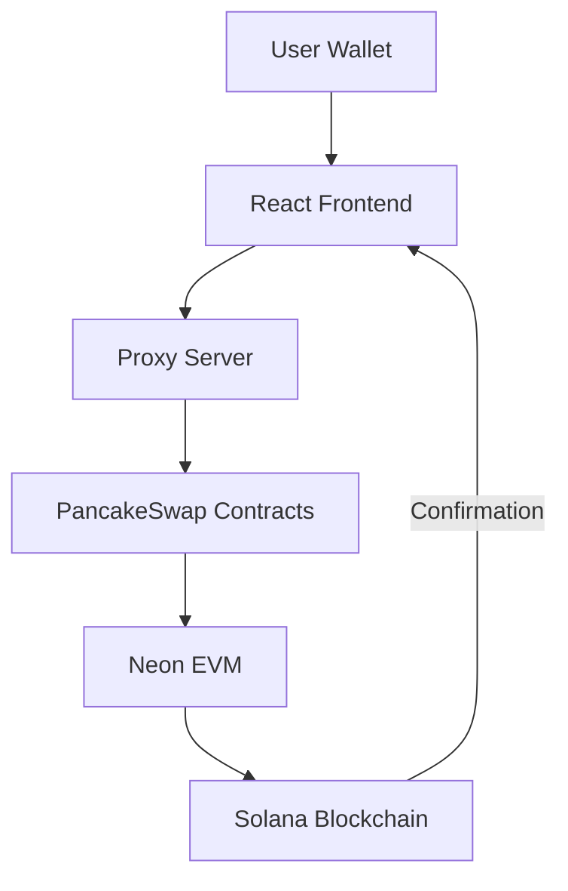
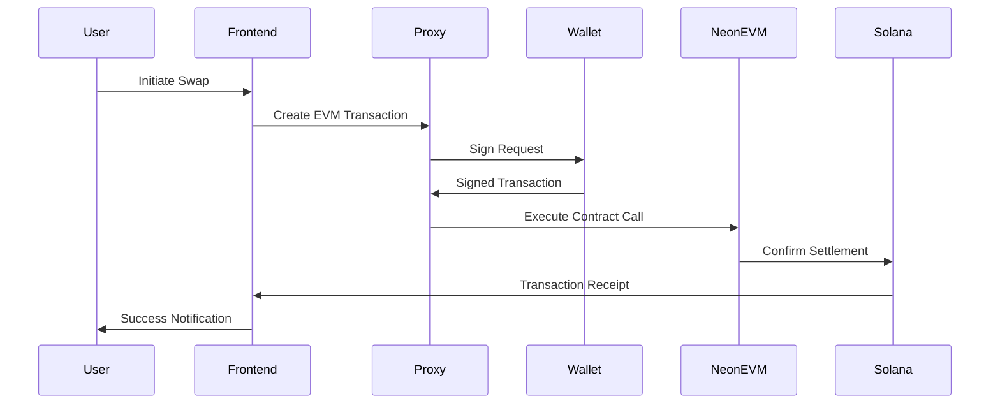

# NeonSwap: Cross-Chain DeFi Protocol on Neon EVM

## 🌟 Introduction
NeonSwap bridges Ethereum and Solana ecosystems through Neon EVM, enabling seamless token swaps between chains while maintaining Solana's speed and low fees. This demo showcases how Solana wallets can interact with EVM smart contracts.


## ✨ Key Features

| Feature | Description | Benefit |
|---------|-------------|---------|
| **Cross-Chain Swaps** | Trade between WNEON, SOL, USDC and more | Access both ecosystems |
| **Solana Wallet Support** | Use Phantom/Backpack with EVM contracts | Familiar UX for Solana users |
| **Gas Optimization** | Neon EVM's efficient execution | Lower fees than mainnet Ethereum |
| **PancakeSwap Integration** | Battle-tested AMM infrastructure | Reliable swap mechanics |
|**SOLANASDK FOR FRONTEND INTEGRATION** |React-based UI for performing token swaps|

## 🏗 Technical Architecture



## 🚀 Getting Started

### Prerequisites
- Node.js v18+
- Yarn 1.22+
- Solana CLI 1.10+
- Phantom Wallet extension

### ⚡ Quick Deployment

1

2. **Set environment variables**
   ```bash
   # For both frontend and contracts
   echo "VITE_SOLANA_URL=https://api.devnet.solana.com" >> .env
   echo "VITE_NEON_CORE_API_RPC_URL=https://devnet.neonevm.org" >> .env
   ```

3. **Deploy contracts and run frontend**
   ```bash
   # In one terminal:
   cd pancakeswap && npm install && npx hardhat run scripts/file.js
   
   # In another terminal:
   cd frontend/swap-ui && yarn && yarn dev
   ```

## 📜 Contract Reference (Devnet)

| Contract | Address | Version | Description |
|----------|---------|---------|-------------|
| WNEON | `0x11adC2d986E334137b9ad0a0F290771F31e9517F` | v1 | Wrapped NEON token |
| Factory | `0xe972AC3Bc587A9772B0E4C8236e815639ae842A7` | v2 | Pool creation |
| Router | `0xBC60Eec776C91D44995E5763FEe4A2a7a14e2fFE` | v2 | Swap operations |
| Token A | `0x748e0220746A11E55ecC938012AA555aE5a4366a` | v1 | Test ERC20ForSPL |
| Token B | `0xbf980b326d4Ed7dF8933abab6eF5c22539132413` | v1 | Test ERC20ForSPL |
| Token A v2 | `0x909eA1433ABc9e951132c850116053F1F1f0C77E` | v2 | Test ERC20ForSPLv2 |
| Token B v2 | `0x748e0220746A11E55ecC938012AA555aE5a4366a` | v2 | Test ERC20ForSPLv2 |

## 🔄 Transaction Lifecycle



## 🛠 Customization Guide

### 1. Token Deployment
```javascript
// In pancakeswap/scripts/deploy-tokens.js
await deployERC20ForSPLMintable(
  'YOUR_TOKEN',          // Contract reference key
  'Your Custom Token',   // Token name
  'YCT',                 // Token symbol
  9,                     // Decimals (max 9 for SPL compatibility)
  deployer.address,      // Mint authority
  'ERC20ForSplMintable'  // Contract version
);
```

### 2. Liquidity Pool Configuration
```javascript
// In create-liquidity-pools.js
await createPairAndAddLiquidity(
  factoryAddress,
  routerAddress,
  deployer,
  tokenA, 
  tokenB,
  100000,  // Token A amount (18 decimals)
  200000,  // Token B amount (9 decimals)
  3000,    // LP fee basis points (0.3%)
  true     // Stable pool flag
);
```

## 🔒 Security Considerations

### Audit Checklist
1. [ ] Contract ownership verification
2. [ ] Reentrancy guards
3. [ ] Proper access controls
4. [ ] Input validation
5. [ ] Emergency stop mechanism


## 📚 Resources

### Documentation
- [Neon EVM Docs](https://neon-evm.xyz/docs)
- [Solana Program Library](https://spl.solana.com)
- [PancakeSwap Contracts](https://docs.pancakeswap.finance/code/smart-contracts)

### Tools
- [NeonFaucet](https://neonfaucet.org)

- [NeonScan](https://neonscan.org)

## ⚖️ License
MIT Licensed - See [LICENSE](LICENSE) for details.
